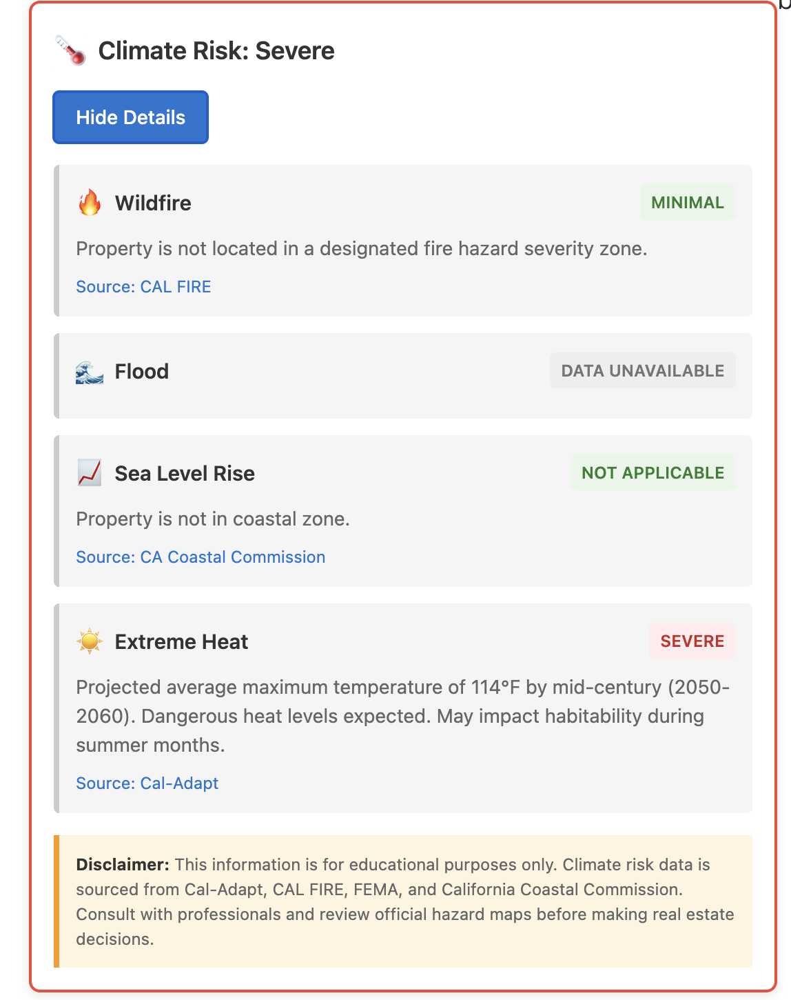

# Climate Risk for Zillow - California

A free, open-source browser extension that displays educational climate risk information for California properties on Zillow, helping homebuyers make informed decisions about climate hazards. This is a proof of concept and should not be relied upon to make purchasing decisions.



## Features

### Real-Time Climate Data

- **🔥 Wildfire Risk** - Official CAL FIRE Fire Hazard Severity Zones (Minimal, Moderate, High, Very High)
- **☀️ Extreme Heat** - Cal-Adapt projections showing mid-century (2050-2060) maximum temperatures
- **🌊 Flood Risk** - Direct links to FEMA Map Service Center for official flood zone verification
- **📈 Sea Level Rise** - Links to NOAA Sea Level Rise Viewer and California Coastal Commission for coastal properties

### User-Friendly Interface

- Color-coded risk badges (green to red)
- Expandable detail panels with actionable information
- Direct links to authoritative data sources
- Automatic caching (30 days) for faster loading

## Installation

### From Chrome Web Store
*Coming soon*

### From Source (Development)

1. Clone this repository:
   ```bash
   git clone https://github.com/yourusername/zillow-climate-risk.git
   cd zillow-climate-risk
   ```

2. Open Chrome and navigate to `chrome://extensions/`

3. Enable "Developer mode" (toggle in top right)

4. Click "Load unpacked"

5. Select the `climate-risk-plugin` directory

6. The extension icon should appear in your toolbar!

## Usage

1. Navigate to a California property on Zillow (individual listing page)
2. The climate risk badge will automatically appear below the property price
3. Click "View Details" to see breakdown by risk type
4. Click source links to verify data on official websites

**Note:** The extension only works on individual property detail pages, not search results pages.

## Data Sources

All climate risk information comes from authoritative public sources:

| Risk Type | Data Source | Update Frequency |
|-----------|-------------|------------------|
| Wildfire | [CAL FIRE Fire Hazard Severity Zones](https://osfm.fire.ca.gov/) | Updated by state |
| Extreme Heat | [Cal-Adapt Climate Projections](https://cal-adapt.org/) | Climate model data |
| Flood | [FEMA Map Service Center](https://msc.fema.gov/) | User verification required |
| Sea Level Rise | [NOAA Sea Level Rise Viewer](https://coast.noaa.gov/slr/) | User verification required |

## Privacy

This extension:
- ✅ Does NOT collect any personal information
- ✅ Does NOT track your browsing history  
- ✅ Does NOT send data to external servers (except public climate APIs)
- ✅ Caches climate risk data locally for 30 days
- ✅ Only activates on Zillow property pages

## Technical Details

### Architecture

- **Client-side only** - No backend server required
- **Smart caching** - Stores results for 30 days to minimize API calls
- **Geocoding fallback** - Uses OpenStreetMap Nominatim when Zillow data unavailable
- **Parallel API calls** - Fetches all risk data simultaneously for speed

### Technologies Used

- Manifest V3 (Chrome Extension)
- Vanilla JavaScript (no frameworks)
- CAL FIRE ArcGIS REST API
- Cal-Adapt Climate API
- OpenStreetMap Nominatim Geocoding

## Contributing

Contributions are welcome! See [CONTRIBUTING.md](CONTRIBUTING.md) for guidelines.

### Priority Improvements

1. **Firefox support** - Port to Firefox Add-ons
2. **Improved flood data** - Find alternative APIs without CORS restrictions
3. **Sea level rise data** - Integrate quantitative projections

## Development

### Project Structure

```
climate-risk-plugin/
├── manifest.json           # Extension configuration
├── icons/                  # Extension icons
├── content/
│   ├── content.js         # Main content script
│   └── content.css        # Styling
├── background/
│   └── background.js      # Service worker
├── popup/
│   ├── popup.html         # Extension popup
│   ├── popup.js
│   └── popup.css
└── utils/
    ├── dataFetcher.js     # API integrations
    └── cache.js           # Caching logic
```

### Running Tests

```bash
# Load extension in Chrome
# Navigate to chrome://extensions/
# Enable Developer mode
# Load unpacked from project directory
```

### Making Changes

1. Fork the repository
2. Create a feature branch (`git checkout -b feature/amazing-feature`)
3. Make your changes
4. Test thoroughly on multiple properties
5. Commit with clear messages (`git commit -m 'Add amazing feature'`)
6. Push to your fork (`git push origin feature/amazing-feature`)
7. Open a Pull Request

## Disclaimer

**Important:** This information is provided for educational purposes only and should not be the sole basis for real estate decisions. 

- Climate risk assessments may not reflect the most current conditions
- Data accuracy varies by location and source
- Professional verification is recommended
- Flood zones require official FEMA verification for insurance
- Consult with qualified professionals before purchasing property

The developers of this extension make no warranties about the accuracy or completeness of this information.

## License

MIT License - See [LICENSE](LICENSE) for details

## Acknowledgments

- **California Energy Commission** - Cal-Adapt platform
- **CAL FIRE** - Fire Hazard Severity Zone data
- **FEMA** - Flood hazard information
- **NOAA** - Sea level rise projections
- **OpenStreetMap** - Nominatim geocoding service

## Support

- **Bug Reports:** [Open an issue](https://github.com/yourusername/zillow-climate-risk/issues)
- **Feature Requests:** [Open an issue](https://github.com/yourusername/zillow-climate-risk/issues)
- **Questions:** [Discussions](https://github.com/yourusername/zillow-climate-risk/discussions)

---

**Made with 🌍 for a more climate-aware future**

*Star this repo if you find it useful!*
