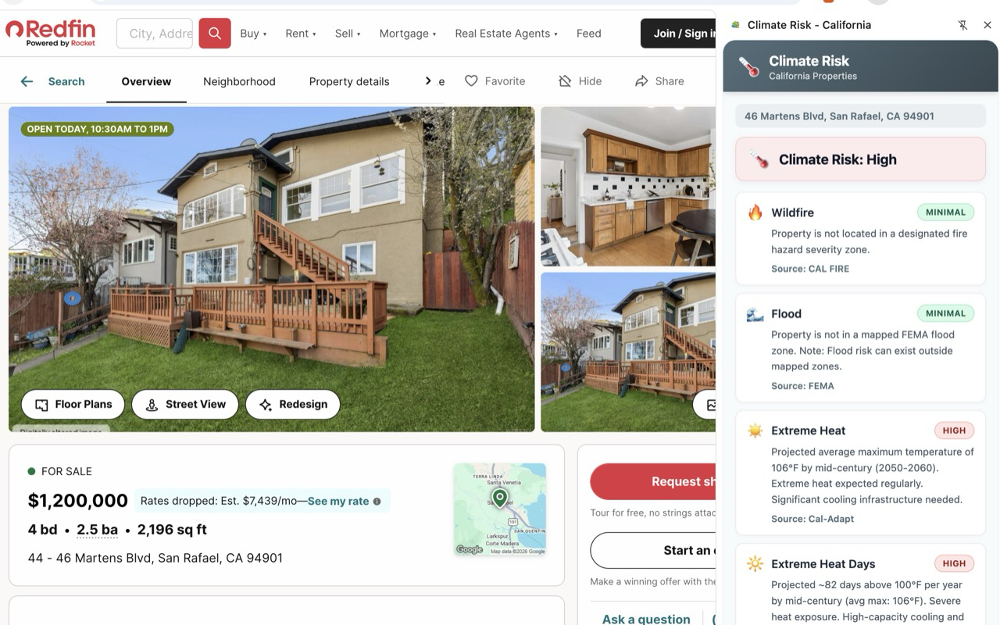

# Climate Risk - California (v1.5.1)

A free, open-source Chrome extension that displays educational climate risk information for California real estate properties, helping homebuyers make informed decisions about climate hazards. This is a proof of concept and should not be relied upon to make purchasing decisions.



## Features

### Current Conditions

* **🔥 Wildfire** — Official CAL FIRE Fire Hazard Severity Zones, queried across both State (SRA) and Local (LRA) Responsibility Areas
* **🌊 Flood** — FEMA National Flood Hazard Layer (NFHL), live point query including SFHA designation

### Mid-Century Projections (2050–2060, RCP 8.5)

* **🔥 Wildfire Probability** — Cal-Adapt / UC Merced decadal wildfire occurrence probability
* **🌊 Projected Flood** — FEMA Future Conditions Flood Hazard data (FC-FIRM), extracted from the same NFHL response
* **☀️ Extreme Heat** — Cal-Adapt projected average annual peak temperature
* **🔆 Extreme Heat Days** — Cal-Adapt projected days above 95°F per year, counted directly from daily model output
* **🌧️ Extreme Precipitation** — Cal-Adapt projected average annual total precipitation
* **📈 Sea Level Rise** — Coastal proximity detection with NOAA 2022 sea level rise projections

The side panel groups risks into **Current Conditions** and **Mid-Century Projections** sections, each with an aggregate risk level badge, plus a headline **Now → 2050** summary showing whether projected risk is higher or lower than current conditions.

### Supported Real Estate Websites

* Zillow
* Realtor.com
* Redfin
* Trulia
* Compass
* Homes.com

### How It Works

The extension reads the property address directly from the browser URL bar — it does not modify or scrape any real estate website. Climate risk data is displayed in a **Chrome Side Panel** that sits alongside the page without interfering with it.

* When you navigate to a supported property listing, the extension icon shows a badge (!)
* Click the icon to open the Climate Risk side panel
* The panel loads automatically and updates as you navigate between listings

## Installation

### From Chrome Web Store

Search for **"Climate Risk - California"** in the [Chrome Web Store](https://chrome.google.com/webstore/), or install directly from your published listing URL.

### From Source (Development)

1. Clone this repository:

   ```bash
   git clone https://github.com/nmatouka/climate-risk-plugin.git
   cd climate-risk-plugin
   ```

2. **Note:** The `flood-zone-data` folder is **not** included in the extension package. It is hosted separately on GitHub Pages for the extension to access.

3. Open Chrome and navigate to `chrome://extensions/`

4. Enable **Developer mode** (toggle in top right)

5. Click **Load unpacked** and select the `climate-risk-plugin` directory

6. **Pin the extension** to your toolbar: click the 🧩 puzzle piece → find Climate Risk → click 📌 pin

## Usage

1. Navigate to an individual property listing on a supported real estate website
2. The extension icon shows a badge (!) when you're on a supported property page
3. Click the icon to open the Climate Risk side panel
4. The panel displays 8 risk indicators grouped into Current Conditions and Mid-Century Projections sections
5. The panel updates automatically as you navigate to other property listings

**Note:** The extension only processes California properties. Non-CA properties will show an informational message.

**First Load:** The first time you view a property, climate data takes 5–15 seconds to load as it queries multiple APIs. Subsequent properties load faster as data is cached for 30 days.

## Data Sources

All climate risk information comes from authoritative public sources:

| Risk Type | Data Source | Timeframe |
|---|---|---|
| Wildfire | [CAL FIRE FHSZ](https://osfm.fire.ca.gov/) (SRA + LRA layers) | Current |
| Flood | [FEMA NFHL](https://hazards.fema.gov/) Layer 28 | Current |
| Wildfire Probability | [Cal-Adapt / UC Merced](https://cal-adapt.org/) | 2050s decade |
| Projected Flood | [FEMA FC-FIRM](https://hazards.fema.gov/) (NFHL ZONE_SUBTY) | Future conditions |
| Extreme Heat | [Cal-Adapt](https://cal-adapt.org/) | 2050–2060 |
| Extreme Heat Days | [Cal-Adapt](https://cal-adapt.org/) | 2050–2060 |
| Extreme Precipitation | [Cal-Adapt](https://cal-adapt.org/) | 2050–2060 |
| Sea Level Rise | [NOAA](https://coast.noaa.gov/slr/) / [CA Coastal Commission](https://www.coastal.ca.gov/climate/slr/) | 2050 / 2100 |

### About Cal-Adapt Data

The Cal-Adapt platform provides downscaled climate projections from global climate models. This extension uses:

- **HadGEM2-ES** climate model under RCP 8.5 emissions scenario
- **Mid-century timeframe** (2050–2060) for consistency
- **Peer-reviewed** methodology from California's Climate Change Assessments

### About Flood Data

Flood data is queried live from FEMA's National Flood Hazard Layer (NFHL) REST API (Layer 28). A single point query returns both the current flood zone (`FLD_ZONE`, `SFHA_TF`) and any Future Conditions designations (`ZONE_SUBTY` containing "FUTURE"), enabling both the Flood and Projected Flood cards from one network request. FEMA's service can return multiple overlapping polygons for a point — the extension selects the highest-risk feature.

## Technical Details

### Architecture

* **Browser Side Panel** — Climate risk data is displayed in Chrome's native side panel, completely separate from the real estate website
* **URL-based address detection** — Property addresses are read from the browser URL bar, not from page content
* **Client-side only** — No backend server required
* **Smart caching** — Results stored for 30 days to minimize API calls
* **Parallel API calls** — All 8 risk indicators fetched simultaneously (flood current + projected share one request)
* **Geocoding** — Addresses geocoded via OpenStreetMap Nominatim to obtain coordinates
* **Current vs. projected layout** — Risks grouped into two sections with aggregate badges and a Now → 2050 headline summary

### Performance

* **Initial load:** 10–30 seconds (Cal-Adapt daily heat days query is the slowest — ~3,650 data points)
* **Subsequent loads:** < 2 seconds (all data cached)
* **Cache duration:** 30 days

### Risk Classification Details

**Wildfire Probability** (10-year occurrence probability, 2050s decade)
- < 3%: Minimal
- 3–6.9%: Low
- 7–14.9%: Moderate
- 15–24.9%: High
- ≥ 25%: Severe

**Projected Flood** (FEMA FC-FIRM future conditions)
- 1%-annual-chance future zone: High
- 0.2%-annual-chance future zone: Moderate
- Other future designation: Low
- Not mapped: Unavailable (FC-FIRM coverage is expanding)

**Extreme Heat Days** (days above 95°F, counted directly from Cal-Adapt daily data)
- < 10 days/year: Minimal
- 10–29 days/year: Low
- 30–59 days/year: Moderate
- 60–89 days/year: High
- ≥ 90 days/year: Severe

**Extreme Precipitation** (projected annual total)
- < 10 in/year: Minimal
- 10–19 in/year: Low
- 20–34 in/year: Moderate
- 35–49 in/year: High
- ≥ 50 in/year: Severe

**Sea Level Rise** — Detects coastal properties (within ~10 miles of coast) using seven validated regional bounding boxes. Reports NOAA 2022 projections: 0.6–1.5 ft by 2050 (intermediate), up to 3.5 ft by 2100 (high scenario).

## Privacy

This extension processes property addresses and coordinates solely to display climate risk data. No personal data is collected, shared, or transmitted to third parties beyond the public APIs listed above. All cached data is stored locally on your device.

## Contributing

Contributions are welcome! See [CONTRIBUTING.md](CONTRIBUTING.md) for guidelines.

### Priority Improvements for Future Versions

1. **Drought and air quality data** — Add when Cal-Adapt makes PDSI and smoke day projections available via API
2. **More accurate heat days** — Query full daily data instead of statistical estimation
3. **Landslide risk** — Integrate USGS data
4. **Water stress indicators** — Add reservoir/groundwater projections
5. **Additional state coverage** — Expand beyond California

## Changelog

See [CHANGELOG.md](CHANGELOG.md) for complete version history.

### v1.5.0 (2026-03-20)
- ✨ Added Wildfire Probability (Cal-Adapt / UC Merced 2050s decadal probability)
- ✨ Added Projected Flood via FEMA FC-FIRM future conditions (from same NFHL request)
- ✨ Replaced local flood GeoJSON with live FEMA NFHL REST API
- ✨ Dual-layer wildfire query (SRA + LRA) for complete CAL FIRE FHSZ coverage
- ✨ Current vs. Projected layout with aggregate risk badges per section
- ✨ Now → 2050 headline summary row showing whether projected risk is higher or lower
- 🔧 Fixed Extreme Heat Days to use actual Cal-Adapt daily data (95°F threshold)
- 🔧 Fixed Extreme Precipitation unit conversion and recalibrated thresholds

### v1.5.1 (2026-04-01)
- 🐛 Fixed flood zone 0.2% (500-year) classification — Moderate level was never shown due to wrong field check
- 🌊 Sea level rise now fetches property elevation (USGS 3DEP); low-elevation properties show inundation severity; elevated properties show cliff/bluff erosion caveat
- 🌧️ Extreme Precipitation now counts days exceeding the local historical 95th percentile wet-day threshold (Cal-Adapt 1981–2010 baseline), not total annual rainfall
- ⚠️ FC-FIRM projected flood description now clarifies it reflects land-use changes, not climate projections
- 📊 Mid-Century Projections section now discloses model (HadGEM2-ES) and scenario (RCP 8.5)
- 🗺️ ZIP-centroid geocoding fallback now shows a visible accuracy warning in results

### v1.4.0 (2025-02-20)
- ✨ Expanded to Realtor.com, Redfin, Trulia, Compass, and Homes.com
- 🔔 Extension icon badge indicates when a supported property page is active
- 🔔 First-install notification prompts user to pin extension
- 🐛 Fixed Trulia `/home/` and Compass `_pid` URL formats

### v1.3.0
- 🏗️ Refactored to Chrome Side Panel — no modification of real estate websites
- 📍 Property addresses now read from the browser URL bar
- 🔒 Removed all content script DOM injection

### v1.2.0
- ✨ Added Extreme Precipitation assessment
- ✨ Added Extreme Heat Days estimates
- 🔧 Improved sea level rise guidance for coastal properties

### v1.1.0
- ✨ Added FEMA flood zone integration
- ✨ Added loading indicators

### v1.0.0
- 🎉 Initial release — Wildfire, flood, heat, sea level rise

## Disclaimer

**Important:** This information is provided for educational purposes only and should not be the sole basis for real estate decisions.

* Climate risk assessments show **projections**, not guarantees
* Mid-century data (2050–2060) represents one emissions scenario (RCP 8.5)
* Data accuracy varies by location and source
* Professional verification is recommended for all risk assessments
* Flood zones require official FEMA verification for insurance purposes
* Sea level rise impacts depend on property elevation and local conditions
* Consult with qualified professionals before purchasing property

The developers of this extension make no warranties about the accuracy or completeness of this information.

## License

MIT License — See [LICENSE](LICENSE.md) for details

## Acknowledgments

* **California Energy Commission** — Cal-Adapt platform and climate data
* **CAL FIRE** — Fire Hazard Severity Zone data
* **FEMA** — National Flood Hazard Layer data
* **California Coastal Commission** — Sea level rise guidance
* **NOAA** — Sea level rise viewer and coastal data
* **OpenStreetMap** — Nominatim geocoding service

## Support

* **Bug Reports:** [Open an issue](https://github.com/nmatouka/climate-risk-plugin/issues)
* **Feature Requests:** [Open an issue](https://github.com/nmatouka/climate-risk-plugin/issues)
* **Questions:** [Discussions](https://github.com/nmatouka/climate-risk-plugin/discussions)

---

*Made with 🌍 for a more climate-aware future*
